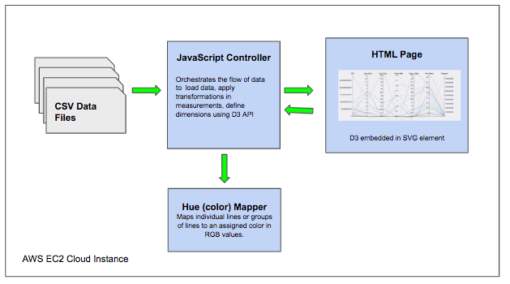

# Data Olimpiad

## Summary

This is a single page inyteractive Web application that provides a data visaulization plot for multivariable analysis to explore the relationships between countries' economics, population, and athletic echievements on the world Olymic games from 1980 to 2016. 

The visaulization employes publicly available datasets on individual Olympic athletes, the Gross Domestic Product (GDP) of individual countries, and population totals for individual countries. The visualization aims to help those interested in sports, economics, or international relations explore a country’s Olympic success over time, and compare that success to population and GDP changes over that same period of time.

## Data Visaulization 

A D3 chart is used to render a  parallel coordinate plot to analyze multiple variables in one interactive single visualization. The parallel coordinate graph is a multi variable analysis chart which helps identify similarities and differences among different variables to find patterns and trends. 

## High Level Components

The Web page with the parallel coordinate plot is embedded into a Tableau URL view as part of a Tableau dashboard. In addition to the D3.js library, we employed other Web libraries to implement interactive features such as jQuery and a custom JavaScript controller. At a high level, the following are the visualization components:

A D3 element is binded into an SVG HTML element in the Web page. The D3 element is the entry point for the D3.js library API into the Web page. This API allows for data loading and transformation which is rendered in real time as the user applies brushing and filtering as well as loading of historical data. These interactive features were developed in a JavaScript controller library which orchestrates the flow of data between the source data files in CSV format and the rendering of the visualization. Colors are applied to a line or groups of lines based on a specific criteria such as grouping countries by their continent using a hue mapper. The hue mapper was also developed in JavaScript to assign color values using an array of predefined RGB values. 

## Live Demo

Live demo can be found at: http://184.73.47.34/

The Web pages with the embedded D3 plot, data files, and Javascript controllers are stored and hosted on an Amazon EC2 instance using a standard Web server ( Apache Web Server).

## Parallel Coordinates Plot Features

Countries that participated in the olympic games for a specific year and season are assigned a line in the graph. The parallel coordinates graph plots the following variables:

1. GDP of the country in a given year
2. Medal count for all participants in that country
3. Different counts of awarded gold, silver and bronze medals
4. Number of participating athletes
5. The recorded total population for that country in a given year
6. The continent the country belongs to based on the color line.

The lines in the graph connect values associated with these different types of variables, and each of these variables are quite different. Although the variables are quite different, we can connect them because we have defined a common base line scale for all these variables , so that each variable is scaled independently using original values.

One of the key benefits of parallel coordinate plots is to provide interactivity to users to enable them perform data exploration and data on-demand discoveries. Key features for data exploration implemented in our parallel coordinates visualization include:

1. Ranking countries by similarity using the brush filter feature on each axis variable
2. Clustering items by similarity using the brush filter feature on each axis variable
3. Interactive historical data visualization from 1980 to 2016 by Summer and Winter Games.
A slider is included in the visualization to navigate across different years and game seasons.
4. Searching of keywords to find country names and provide data on demand on both the graph and a data list
5. Tooltips in drawn lines in the chart to get a short summary of variables for a given country such as GDP, population, and awarded medals by category.

